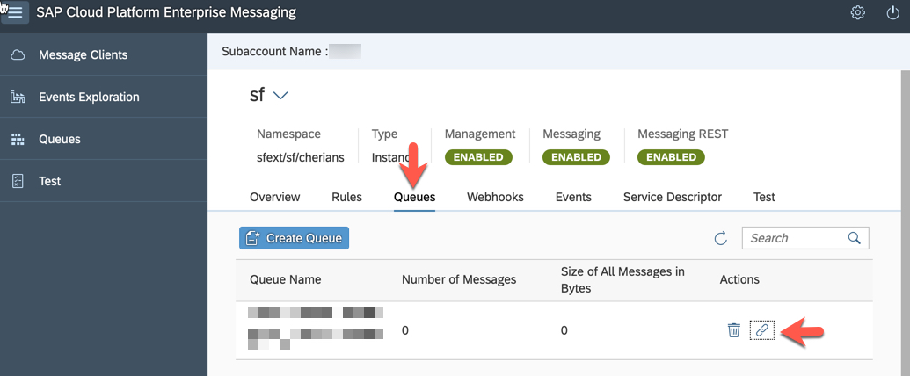
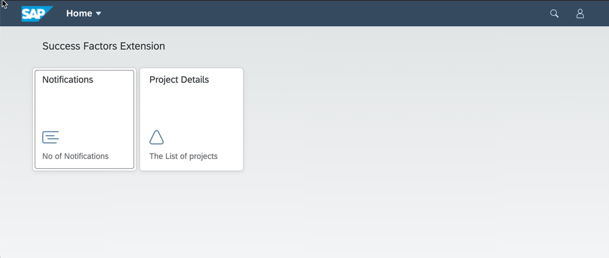
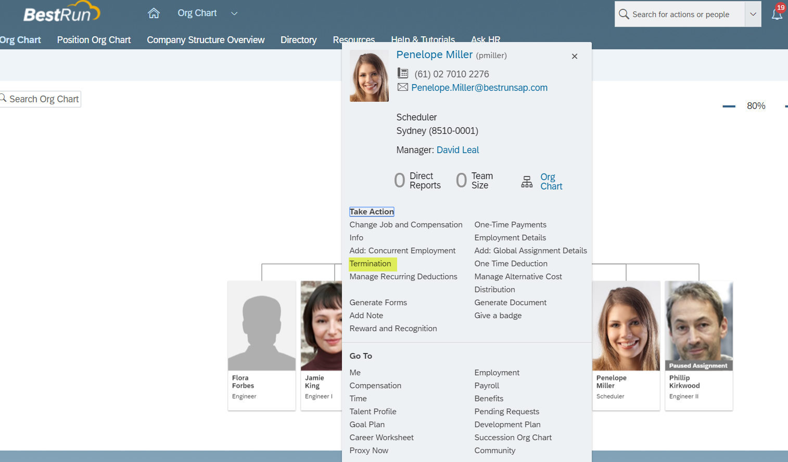
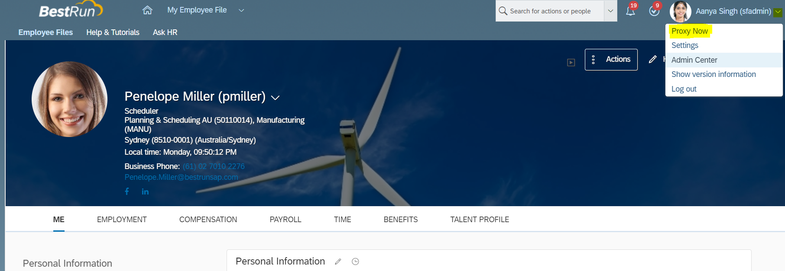
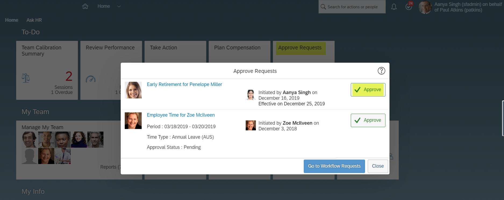
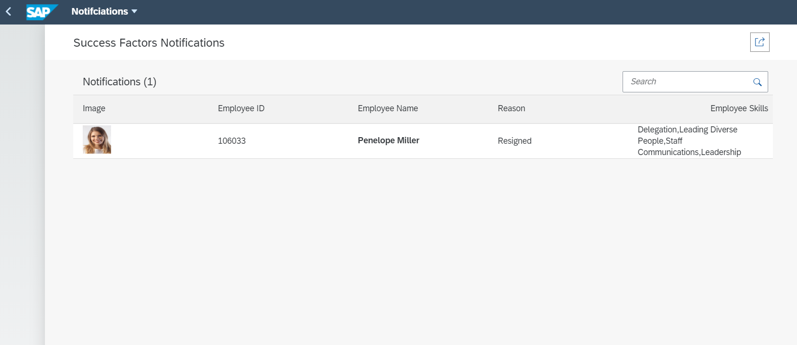

# SAP SucessFactors Extension Application - "Run Smooth"

## Description:
`Run Smooth` is a reference application which showcases how to build an event driven extensions for SAP Successfactors using the capabilities provided by [SAP Cloud Platform Extension Factory](https://help.sap.com/viewer/7b98ddc13f8d4a3ba08a74042a0baa7f/Cloud/en-US). This solution is developed by extending the Employee Central module of SAP Successfactors to build an event driven application.

This application showcases:
1. Capabilities of SAP Cloud Platform Extension Factory
2. Building of application on f SAP Cloud Platform using SAP Cloud Application Programming Model(CAP)
3. Building and Event driven extension application using SAP CP Enterprise Messaging
4. Consuming REST API’s from SAP Successfactors uising SAP CP Connectivity Service


## Business Scenario:

In this reference application called as Run Smooth a business scenario is used to showcase the technology components.
A Manager maintains in the Run Smooth application the staffing details of all the projects to which the employees reporting to him are contributing to.  He can create project and assign employees to the projects. An employee contributing to a project might decide to leave the team/ company. When this occurs the manager get a notification with the projects the employee is working upon and the skills the employee has. This information can be used by manager to find/hire a replacement for employee who decides to leave and assign the projects.

#### Features:
* Create Projects
* Assign Employees
* View the list of projects, employees working on the projects.
* Get notification when an employee is leaving the team with the consolidated report on the skills of the employee.

## Architecture

### Solution Diagram


The Run Smooth application is developed using [SAP Cloud Application programming Model (CAP)](https://cap.cloud.sap/docs/) and runs and runs on the SAP Cloud Platform Cloud Foundry Environment. It consumes platform services like Enterprise Messaging, SAP HANA and Connectivity. The events generated in SuccessFactors are inserted into the Enterprise messaging queue. The application running in Cloud Foundry polls the queue for these messages and inserts them into the HANA database. The run smooth application also makes calls to SF oData APIs to get SF data.

## Requirements
* [Node js](https://nodejs.org/en/download/)
* SuccessFactors test or demo instance.
>Note: Please do not try running this application against  a Successfactors productive instance as it involves triggering a Termination Event from Successfactors.
* [Cloud Foundry Command Line Interface (CLI)](https://github.com/cloudfoundry/cli#downloads)
* SAP Cloud Platform account with [Enterprise Messaging](https://help.sap.com/viewer/product/SAP_ENTERPRISE_MESSAGING/Cloud/en-US) service. The 'default' plan for Enterprise Messaging service is required.
* To build the multi target application, we need the [Cloud MTA Build tool](https://sap.github.io/cloud-mta-build-tool/), download the tool from [here](https://sap.github.io/cloud-mta-build-tool/download/)
* For Windows system, install 'MAKE' from https://sap.github.io/cloud-mta-build-tool/makefile/
>Note: Please set the npm registry for @sap libraries using the command :  
`npm set @sap:registry=https://npm.sap.com`
* Install the following:
	1. grunt 	- `npm install -g grunt-cli`
	2. cds	 	- `npm install -g @sap/cds`
	3. multiapps plugin - `cf install-plugin multiapps`

## Configuration

### Step 1: Configure trust between SF and SAP CP using Extension Factory

 Follow steps 1, 2 and 4 from this [document](https://help.sap.com/viewer/65de2977205c403bbc107264b8eccf4b/Cloud/en-US/9e33934540c44681817567d6072effb2.html) to set up trust and destination to access SuccessFactors system using Extension Factory.
> Ignore step 3 in the document as the service instance creation is automatically done when the application is deployed as a MTA.

### Step 2: Project Configuration
1. [Clone](https://help.github.com/articles/cloning-a-repository/) this [repository](../..)
2. Open [mta.yaml](mta.yaml)
3. Go to the section `Success Factors Extensibility Service` and modify the SuccessFactors System name as per the name given while registering the System in previous step.
3. Go to the section `Enterprise Messaging Service`
4. Check in your CF account that "default" service plan is available for Enterprise Messaging Service.
5. Modify `"emname": "<yourmessageclientname>","namespace": "<yourorgname>/<yourmessageclientname>/<uniqueID>"` with necessary details in the “em.json” file.
> The `<yourmessageclientname>` and `<uniqueID>` can be any random unique identifier. `<yourorgname>` would be your org name without '-' or any special character.  Please make sure that namespace does not exceed 24 characters. For more details regarding syntax, size and characters allowed in namespace are mentioned [here](https://help.sap.com/viewer/bf82e6b26456494cbdd197057c09979f/Cloud/en-US/5696828fd5724aa5b26412db09163530.html?q=namespace)
6. Check if the Cloud Foundry Space you will be deploying the application has the following entitlements:

| Service                           | Plan       | Number of Instances |
|-----------------------------------|------------|:-------------------:|
| Destination                       | lite       |          1          |
| Enterprise Messaging              | default    |          1          |
| SAP HANA Schemas & HDI Containers | hdi-shared |          1          |
| SAP SuccessFactors Extensibility  | api-access |          1          |
| SAP Hana Service                  | 64standard |          1          |
| Application Runtime               |            |          3          |

7. Create SAP Hana Service instance with plan 64standard as described [here](https://help.sap.com/viewer/cc53ad464a57404b8d453bbadbc81ceb/Cloud/en-US/21418824b23a401aa116d9ad42dd5ba6.html)
> If there are multiple instances of SAP Hana Service in the space, please modify the  mta.yaml as shown below. Replace <database_guid> with the id of the databse you would like to bind the application with :
 ```
 # Hana HDI Container
  - name: cloud-cap-xf-sf-db-hdi-container
    parameters:
      service: hana
      service-plan: hdi-shared
      config:
        database_id: <database_guid>
    properties:
      hdi-container-name: '${service-name}'
    type: com.sap.xs.hdi-container
```

### Step 3: Deploy the reference application

1. Build the application
    `mbt build -p=cf `  
3. Login to Cloud Foundry by typing the below commands on command prompt
    ```
    cf api <api>
    cf login -u <username> -p <password>
    ```
    `api` - [URL of the Cloud Foundry landscape](https://help.sap.com/viewer/65de2977205c403bbc107264b8eccf4b/Cloud/en-US/350356d1dc314d3199dca15bd2ab9b0e.html) that you are trying to connect to.

    Select the org and space when prompted to. For more information on the same refer [link](https://help.sap.com/viewer/65de2977205c403bbc107264b8eccf4b/Cloud/en-US/75125ef1e60e490e91eb58fe48c0f9e7.html#loio4ef907afb1254e8286882a2bdef0edf4).

4. Deploy the application

	Navigate to mta_archives folder and run the below command from CLI

   `cf deploy cloud-cap-xf-sf_0.0.1.mtar`

### Step 4: Enterprise Messaging Application
1. Follow the steps [here](https://help.sap.com/viewer/bf82e6b26456494cbdd197057c09979f/Cloud/en-US/d6389ec67f2e451b8d4cadc19c4bc369.html) to subscribe to the Enterprise Messaging Business Application
2. Follow the steps [here](https://help.sap.com/viewer/bf82e6b26456494cbdd197057c09979f/Cloud/en-US/637d331010e54a2999e2f023d2de1130.html) to add the necessary roles to the user to access the Enterprise Messaging Business Application
3. Open your global account, then your subaccount.
4. In the left pane, choose Subscriptions.
5. Choose Enterprise Messaging and click on `Go to Application` link.
> The Go to Application link becomes available once the subscription is activated.
6. In the application, choose the messaging client (specified in the Project Configuration>Step 2.5) created when the application is deployed.
7. Go to the tab `Queue`.

8. From the table, click on Icon for 'Subscription' (under Actions) for the Queue created when the application was deployed.
9. From the pop-up window, please note the topic name for future reference (Step 5.8)
10. Create Service Keys for Enterprise Messaging Service by following steps [here](https://help.sap.com/viewer/65de2977205c403bbc107264b8eccf4b/Cloud/en-US/cdf4f200db3e4c248fa67401937b2f78.html). Note down the clientid, clientsecret, tokenendpoint from the service key which is shown as a json.

### Step 5: Setting up SuccessFactors system

In this step, you will configure the successFactors system to send message to the Enterprise Messaging service on Cloud platform.

1. Login to the sf demo instance.

    username: sfadmin
    password: `<It will be provided to you in the mail that you receive on requesting for demo instance. >`

2. Setting Outbound OAuth Configurations. In this step, the credentials required to send messages to the Enterprise Messaging service are set.

   1. In the demo instance search bar, search for `Integration center`
   2. Select `Security center`
   3. Select `Outbound OAuth Configurations`
   4. Click on `Add` to create new OAuth configuration
   5. Enter the below detail:

      OAuth Type: `OAuth 2.0`

      Grant Type: `Client_Credentials`

      `Client ID`, `Client Secret`, `Token URL`: you can get these details from the service key of the enterprise message service instance you created in Step 1. If there is no existing service key, please create it in the Cloud Platform cockpit.

      Add Custom Header Parameters.

      Add new row: key=x-qos. Value =1

3. Creating integration. An integration specifies the endpoint to which a message should be send along with the content of the message.
   1. Navigate to integration center.
   2. Select `My Integrations`
   3. Select `Create` > `More Integration Types`
   4. Select the below options and click on Create:

      Trigger type: Intelligent service

      Destination type: REST

      Format: JSON

   

4. Search for the [Intelligent Service](https://help.sap.com/viewer/b8da92fb08c347cbab0c8fff82af0a3f/1911/en-US/3d91617db9a94903a0237747e4eda11f.html) `Employment Termination`. Select it and click on `Select` button.

5. Provide details for the integration.
   1. Enter name for the integration and click next
   2. In Configure Fields tab, Click `+` button . Insert sibling elements
   3. Select the created element and set label as 'employeeId'
   4. Click on `Set as Assosiated field` button. Select entity tree view. Select `User ID`. Click on 'Change Association to User Id'
   
   5. Similarly add new sibling for `managerId` and associate it with Supervisor id.
   6. Add new sibling element `message` with default value as 'Resigned'. Click Next
   7. Keep the default settings for `Response field`, `Filter` tabs. Click Next
   8. Edit the `Destination Settings` with the following details:

      REST API URL: give the URL of the queue
      `https://enterprise-messaging-pubsub.cfapps.eu10.hana.ondemand.com/messagingrest/v1/topics/<topicName>/messages`
      > Use the topic name from Step 4.9 after double encoding.
      
      > For example, if your topic name is `sfext/sf/sample/myMessaging/d41d/sfemessage`, then the `/` should be replaced with `%252F`.
      The resultant topic name will be `sfext%252Fsf%252Fsample%252FmyMessaging%252Fd41d%252Fsfemessage`.
      

      Authentication type: OAuth

      OAuth Configuration: Select the configuration created in Step 2 above on Setting Outbound OAuth Configurations.

      

   9. Click on `Save`

   10. In `Review and Run` tab - click on `Run now`

 6. Configuring the event flow. This step ensures that when the event is triggered, the integration created in the above step is run.
   1. Search for `Intelligent Service Center` in the demo instance search bar and Open it.
   2. Select `Employment Termination` event. There are many more events available, in our scenario,
   3. Add integration for the existing flow:
      - Click on `Integration` under `Activities`. (on the right-hand side corner)
      - Select the Integration created in the previous step. Click on `Add integration`.
      - Change the 'Timing' of the Integration to 'When the event is published' and save the flow (`Actions > Save Flow`).


## Demo Script

1. In the command line interface run the command `cf apps`
2. Find URL for app `cloud-cap-xf-sf-app` which is the launch URL for Run Smooth application
3. Launch the URL and login as dleal(David Leal)
> You can choose any employee who is a Manager.
4. Click on Project Details tile

5. Click on a Project from the list.
6. Click on Assign Employee.
7. All employees reporting to David Leal is displayed.
8. Select 1 or more employees and assign them to projects
9. Login to SF demo instance with sfadmin user.

10. Search for Employee David Leal (dleal) in the Employee Directory
11. Select Employee David Leal
12. Click on Actions button and Select Org Chart

13. Choose an employee who is reporting to 'David Leal e.g Penelope Miller(pmiller) and assigned to the project in step 8
14. Click on Take Actions button and Select Termination

15. Set values for
      - Termination Date (Recommended to use a future date. For example, a date one week from the current date)
      - Termination Reason - Early Retirement
      - Ok to Rehire - Yes
      - Regret Termination - Yes

16. Click on Save.
17. In the window `Please confirm your request`, click on the 'Show workflow participants'.
18. Workflow participants would be shown as 1. Paul Atkins (Production Director); 2. Tessa Walker (HR Business Partner Global), Christine Dolan (Chief Human Resources Officer)
> This means that Paul Atkins and Tessa Walker (or Christine Dolan) must approve this request to proceed.
19. Click on Confirm button
20. Use Proxy Now functionality and Select Target User as Paul Atkins(patkins)

21. In the Home page of Paul Atkins click on tile Approve Requests
22. Click on Approve button for the request for approval of Early Retirement of Penelope Miller

23. Use Proxy Now functonality and Select Target User as Tessa Walker(twalker)
24. In the Home page of Tessa Walker click on tile Approve Requests
25. Click on Approve button for the request for approval of Early Retirement of Penelope Miller
26. Open the Web Application UI for Run Smooth application in browser.
27. Login with user David Leal (dleal).
28. Click on notifications tile.

29. Notification will be displayed regarding Resignation of Penelope Miller along with her Skillset.


## Known Issues

No known issues.

## How to Obtain Support

In case you find a bug, or you need additional support, please open an issue [here](https://github.com/SAP-samples/cloud-sf-extension-cap-sample/issues/new) in GitHub.

## License

Copyright (c) 2019 SAP SE or an SAP affiliate company. All rights reserved.
This project is licensed under the SAP Sample Code License Agreement except as noted otherwise in the [LICENSE](/LICENSE) file.
